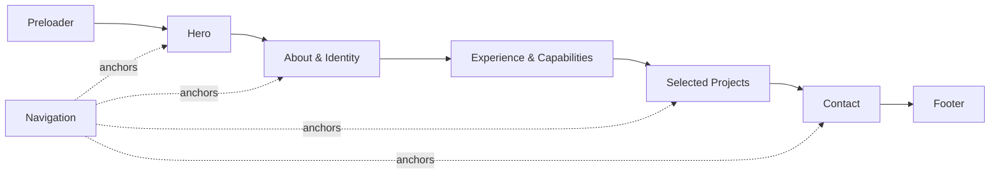

# Garv Mittal — Portfolio

> A personal portfolio for full-stack development, scalable systems, and AI-powered web experiences.

[](https://nextjs.org/)
[](https://www.typescriptlang.org/)
[](https://threejs.org/)
[](#)

**Live site:** [garv-web-portfolio.vercel.app](https://garv-web-portfolio.vercel.app/)

This is my personal portfolio website, built to bring together my work as a full-stack software developer. It is a visual, interactive space for exploring my selected projects, experience, technical capabilities, and the kind of systems I like to build.

The site combines an editorial layout with subtle motion and WebGL details. The goal was to keep the interface expressive without losing the clarity and performance expected from a professional portfolio.

## Experience at a glance

- A responsive introduction and personal profile
- Selected experience, education, capabilities, and milestones
- Project showcase featuring MindSpace 3, Portfolio, Vid-Tube, and ConceptLensAI
- Motion-based transitions and scroll interactions
- Interactive 3D elements powered by React Three Fiber and Three.js
- Custom cursor, preloader, navigation, and theme switching
- Direct contact links for email, GitHub, LinkedIn, and the live portfolio

## Page flow

The home page is intentionally structured as a single scrollable narrative:



The 3D components sit alongside the content rather than replacing it, so the important information remains accessible on smaller screens and devices with limited graphics support.

## Tech stack

- Next.js 15 with the App Router
- React 19 and TypeScript
- Tailwind CSS 4
- Motion for React for animation and interaction
- React Three Fiber, Drei, and Three.js for 3D experiences
- Lucide React for interface icons
- Google Gemini API integrations for AI-focused projects

## Getting started

#### Prerequisites

- Node.js 18.18 or later
- npm, pnpm, yarn, or another compatible package manager

#### Installation

```bash
npm install
```

#### Run locally

```bash
npm run dev
```

Open [http://localhost:3000](http://localhost:3000) in a browser to view the site.

## Available scripts

| Command | Description |
| --- | --- |
| `npm run dev` | Starts the local development server |
| `npm run build` | Creates a production build |
| `npm run start` | Runs the production server |
| `npm run lint` | Checks the project with ESLint |
| `npm run clean` | Clears the Next.js build output |

## Project structure

```text
portfolio_3d/
├── app/
│   ├── api/ping/route.ts     Health-check API route
│   ├── globals.css           Global styles and theme tokens
│   ├── layout.tsx            Fonts, metadata, and root layout
│   └── page.tsx              Main page composition
├── components/
│   ├── About.tsx              Profile, experience, and capabilities
│   ├── Contact.tsx            Contact details and external links
│   ├── Contact3D.tsx          Contact section 3D scene
│   ├── Hero.tsx               Introductory hero section
│   ├── Hero3D.tsx             Hero section 3D scene
│   ├── ProjectShowcase.tsx    Featured project data and presentation
│   └── ...                    Navigation, footer, cursor, and UI helpers
├── hooks/                     Reusable React hooks
├── lib/                       Shared utilities
├── public/                    Static images and public files
├── assets/                    Project and visual assets
├── next.config.ts             Next.js configuration
├── package.json               Scripts and dependencies
└── tsconfig.json              TypeScript configuration
```

### How the main page is assembled

```text
app/page.tsx
├── Preloader
├── CustomCursor
├── Navigation
├── Hero
│   └── Hero3D
├── About
├── ProjectShowcase
├── Contact
│   └── Contact3D
└── Footer
```

## Customization

The main page is composed in `app/page.tsx`. The content for the profile, experience, and capabilities lives in `components/About.tsx`, while the featured projects are defined in `components/ProjectShowcase.tsx`. Contact details and external links can be updated in `components/Contact.tsx`.

Project images should be placed in `public/`, and their paths can then be updated in the project data inside `ProjectShowcase.tsx`.

## Deployment

The project is ready to deploy on Vercel or any platform that supports Next.js. Create a production build before deployment to verify the application locally:

```bash
npm run build
npm run start
```

## Contact

I am based in India and currently pursuing a B.Tech in Computer Science at the University of Lucknow. I am interested in full-stack development, scalable backend systems, AI-powered applications, and thoughtful web experiences.

- Email: [mittal04garv@gmail.com](mailto:mittal04garv@gmail.com)
- GitHub: [github.com/garv-mittal](https://github.com/garv-mittal)
- LinkedIn: [linkedin.com/in/garv-mittal-5243951bb](https://www.linkedin.com/in/garv-mittal-5243951bb/)

